# 🦌 DeerFlow 2.0 使用指南

> 本指南面向 Windows 10/11 用户，详细介绍 DeerFlow 2.0 的界面操作和功能使用。

---

## 第一部分：基本界面及配置

### 1.1 首页概览

启动 DeerFlow 后，在浏览器中打开 `http://localhost:3000`，你会看到首页：

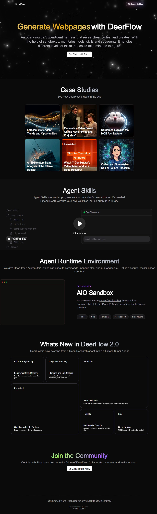

首页展示了 DeerFlow 的核心能力介绍和精选示例：

- **核心特性展示**：长短期记忆、规划与子任务、技能与工具、沙箱文件系统、多模型支持、开源
- **精选示例**：点击任意示例卡片可直接体验对应功能，包括：
  - 预测 2026 年 Agent 趋势（深度研究报告 + 网页生成）
  - 基于《傲慢与偏见》生成视频
  - 哆啦A梦漫画讲解 MOE 架构
  - 泰坦尼克号数据探索性分析
  - Y Combinator 深度研究
  - 李飞飞播客收集与总结

点击 **"Get Started with 2.0"** 按钮或顶部导航栏的 "DeerFlow" Logo 即可进入工作区。

---

### 1.2 工作区布局

进入工作区后，界面分为以下几个区域：

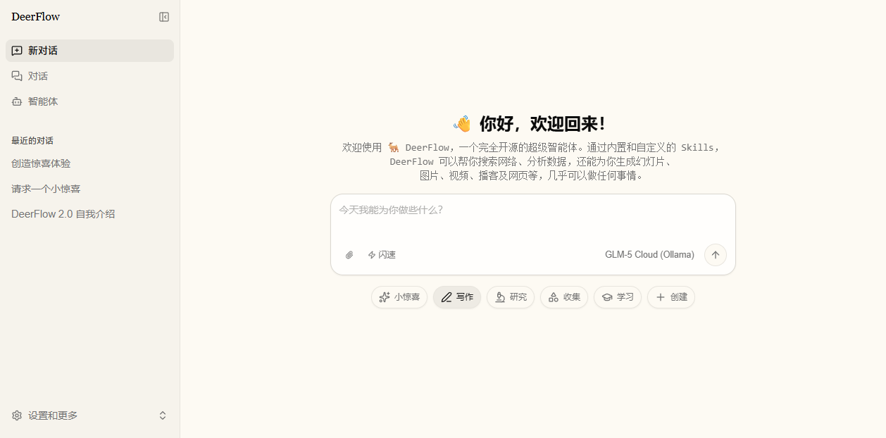

#### 左侧边栏

| 区域 | 功能 |
|------|------|
| **新对话** | 创建一个新的对话会话 |
| **对话** | 查看最近的对话历史列表 |
| **智能体** | 管理自定义智能体 |
| **对话历史** | 显示最近的对话，鼠标悬停可进行更多操作（重命名、分享、删除） |

点击侧边栏切换按钮可折叠/展开侧边栏。

#### 右侧主区域

- **对话消息区**：显示用户消息和 AI 回复
- **Artifact 面板**：右侧可展开的面板，展示 AI 生成的文件（代码、网页、图片等）

#### 底部输入区域

这是 DeerFlow 最核心的交互区域，包含：

- **输入框**：输入你的问题或指令（占位符："今天我能为你做些什么？"）
- **快捷技能按钮**：小惊喜、写作、研究、收集、学习、创建
- **执行模式选择**：闪速、思考、Pro、Ultra
- **模型选择器**：切换不同的 AI 模型
- **附件按钮**：上传文件（回形针图标）
- **提交按钮**：发送消息

---

### 1.3 设置面板

点击右上角的 **"设置和更多"** 按钮，弹出设置菜单：

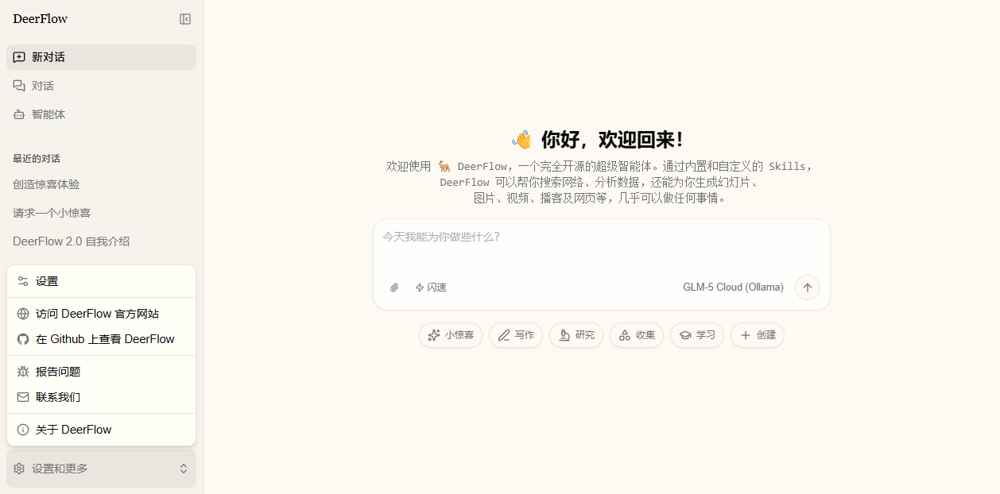

菜单包含以下选项：

| 选项 | 说明 |
|------|------|
| **设置** | 打开设置面板 |
| **访问 DeerFlow 官方网站** | 跳转到原版项目官网 |
| **在 Github 上查看 DeerFlow** | 跳转到 GitHub 仓库 |
| **报告问题** | 提交 Bug 反馈 |
| **联系我们** | 联系开发者 |
| **关于 DeerFlow** | 查看版本信息 |

点击 **"设置"** 后，打开设置面板，包含 6 个标签页：

#### 1.3.1 外观设置

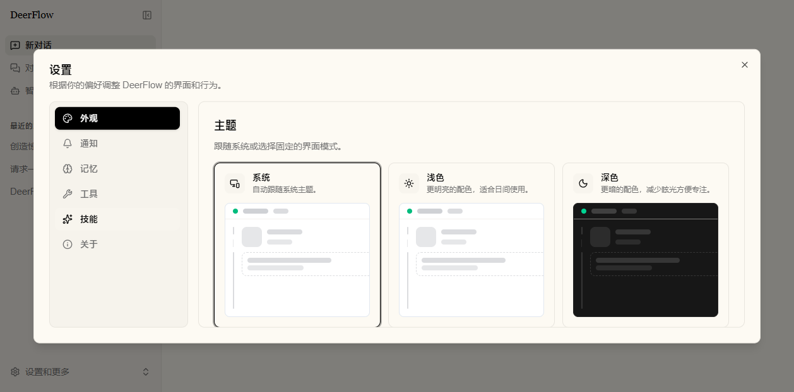

- **主题切换**：系统（跟随系统）、浅色、深色
- **语言切换**：中文 / English

#### 1.3.2 工具设置

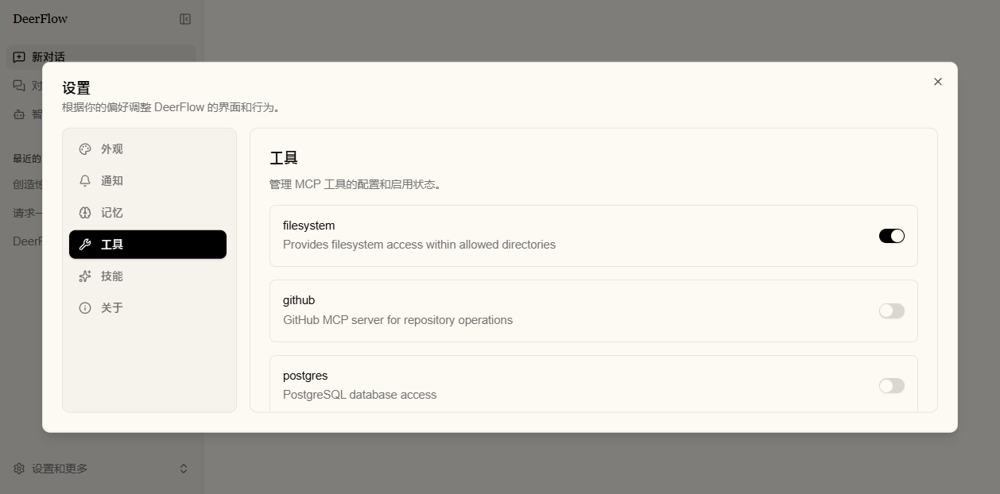

- 管理 MCP 工具的启用/禁用状态
- 通过开关控制每个工具是否可用
- 工具包括 filesystem 等扩展能力

#### 1.3.3 技能设置

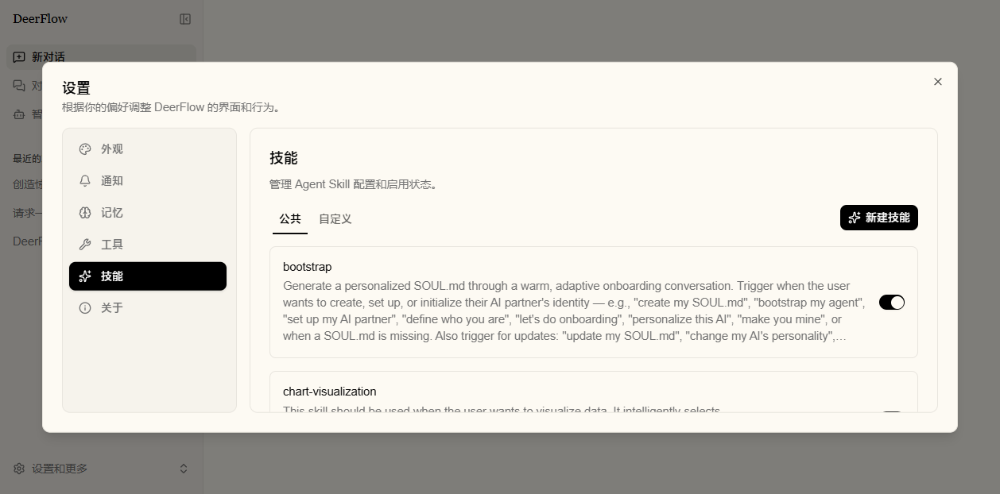

- **公共技能**：DeerFlow 内置的技能（deep-research、frontend-design、image-generation 等）
- **自定义技能**：用户自己创建的技能
- 每个技能可通过开关启用/禁用
- 点击 **"新建技能"** 可通过对话创建新技能

内置公共技能列表：

| 技能名称 | 功能 |
|----------|------|
| `deep-research` | 在内容生成前进行系统性多角度网络研究 |
| `frontend-design` | 创建生产级前端界面（网站、Landing Page、仪表盘等） |
| `github-deep-research` | 对 GitHub 仓库进行多轮深度分析研究 |
| `image-generation` | 生成角色、场景、产品等视觉内容 |
| `podcast-generation` | 将文本转换为双人对话播客格式 |
| `ppt-generation` | 生成 PPT 幻灯片（含每张配图） |
| `skill-creator` | 指导用户创建新的 Agent Skill |
| `vercel-deploy` | 将应用部署到 Vercel |
| `video-generation` | 生成视频内容 |
| `web-design-guidelines` | 审查 UI 代码是否符合最佳实践 |

#### 1.3.4 记忆设置

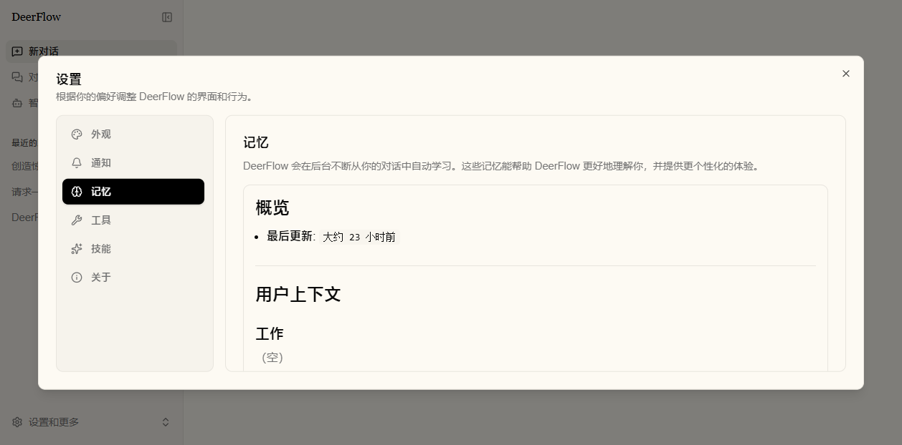

DeerFlow 会在后台自动从对话中学习，形成记忆：

- **概览**：用户上下文总览（工作、个人）
- **近期关注**：最近关注的话题和兴趣
- **历史背景**：近几个月和更早的上下文
- **事实记忆**：偏好、行为、上下文等分类记忆条目

每条记忆包含类别、置信度、内容、来源和创建时间。

#### 1.3.5 通知设置

- 开启/关闭浏览器通知
- 当窗口不活跃且 AI 回复完成时，发送桌面通知
- 支持发送测试通知验证功能

#### 1.3.6 关于页面

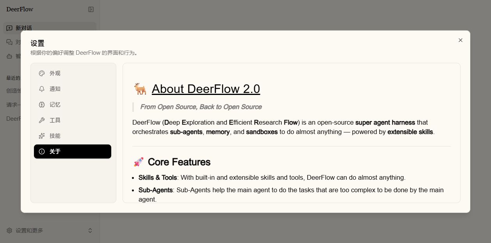

显示 DeerFlow 的版本信息、致谢和相关链接。

---

### 1.4 模型选择

输入框右下角显示当前使用的模型名称（如 "GLM-5 Cloud"），点击后弹出模型选择器：

- 支持模糊搜索模型名称
- 显示每个模型的 Provider Logo
- 支持 50+ 模型提供商（OpenAI、Anthropic、Google、DeepSeek、阿里、智谱等）
- 切换模型后，执行模式会自动调整（不支持思考模式的模型自动降级为闪速模式）

---

### 1.5 执行模式

DeerFlow 提供 4 种执行模式，对应不同的推理深度：

| 模式 | 图标 | 说明 | 推理深度 | 适用场景 |
|------|------|------|----------|----------|
| **闪速** | ⚡ | 快速高效完成任务，可能不够精准 | 最低（检索 + 直接输出） | 简单问答、快速查询 |
| **思考** | 💡 | 思考后再行动，平衡时间与准确性 | 低（简单逻辑校验 + 浅层推演） | 需要一定推理的任务 |
| **Pro** | 🎓 | 思考、计划再执行，获得更精准的结果 | 中（多层逻辑分析 + 基础验证） | 复杂分析、报告撰写 |
| **Ultra** | 🚀 | 可调用子代理分工协作，能力最强 | 高（全维度推演 + 多路径验证） | 多步骤复杂任务 |

在非闪速模式下，如果模型支持，还可以手动调节 **推理深度**：最低 / 低 / 中 / 高。

> **注意**："思考" 和 "Ultra" 模式需要模型支持（`supports_thinking: true`），否则会自动降级。

---

## 第二部分：具体使用指南

### 2.1 对话功能

#### 2.1.1 发送消息

在工作区底部输入框中输入问题，按 **Enter** 或点击提交按钮发送：

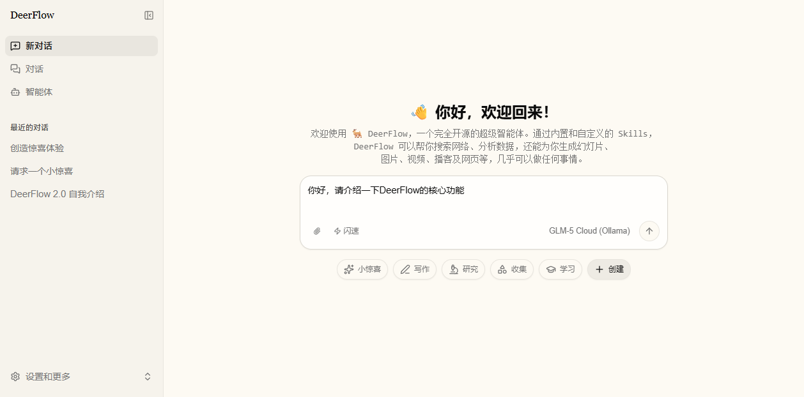

AI 回复后，会自动生成 3-5 个后续建议问题，显示在输入框上方。点击即可快速追问：

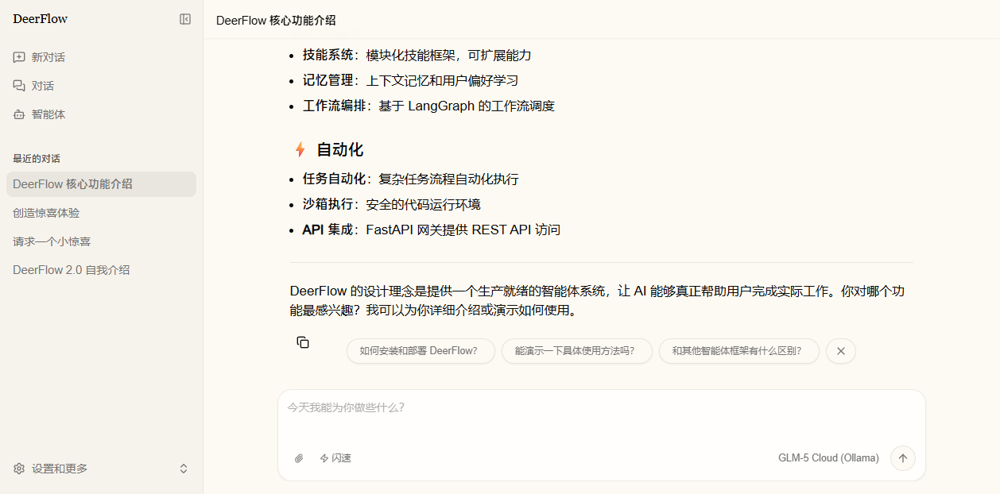

#### 2.1.2 文件上传

- 点击输入框左下角的 **回形针图标** 添加附件
- 或直接将文件 **拖拽到页面任意位置** 上传
- 支持多文件同时上传
- 上传后的文件会显示在输入框上方

#### 2.1.3 智能后续建议

AI 每次回复完成后，自动生成后续问题建议：
- 建议显示在输入框上方
- 点击建议直接填入并自动发送
- 如果输入框已有内容，会弹出确认对话框（替换 / 追加）
- 点击 × 可关闭建议栏

---

### 2.2 快捷技能

输入框下方提供 6 个快捷技能按钮，点击后自动填入提示词模板，`[主题]` 部分会被自动选中，方便替换：

| 按钮 | 提示词模板 | 用途 |
|------|------------|------|
| ✨ **小惊喜** | `给我一个小惊喜吧` | 随机生成创意内容 |
| ✏️ **写作** | `撰写一篇关于[主题]的博客文章` | 博客文章撰写 |
| 🔬 **研究** | `深入浅出的研究一下[主题]，并总结发现。` | 深度研究分析 |
| 📊 **收集** | `从[来源]收集数据并创建报告。` | 数据收集与报告 |
| 🎓 **学习** | `学习关于[主题]并创建教程。` | 学习并生成教程 |
| ➕ **创建** | 展开子菜单 | 创建网页/图片/视频/技能 |

**"创建"按钮** 子菜单：

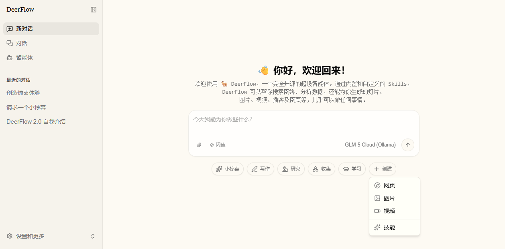

| 选项 | 提示词模板 | 用途 |
|------|------------|------|
| 🧭 **网页** | `生成一个关于[主题]的网页` | 生成完整网页 |
| 🖼️ **图片** | `生成一个关于[主题]的图片` | AI 图片生成 |
| 🎬 **视频** | `生成一个关于[主题]的视频` | AI 视频生成 |
| ✨ **技能** | `我们一起用 skill-creator 技能来创建一个技能吧...` | 创建自定义技能 |

---

### 2.3 智能体管理

#### 2.3.1 查看智能体列表

点击侧边栏的 **"智能体"** 进入智能体管理页面：

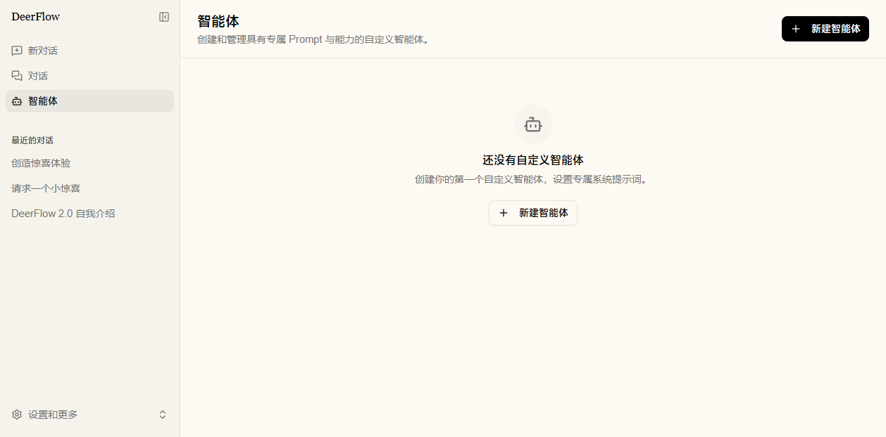

- 显示所有已创建的自定义智能体
- 每个智能体卡片可进行更多操作
- 点击 **"新建智能体"** 创建新的智能体

#### 2.3.2 查看智能体详情

点击智能体卡片进入详情页面：

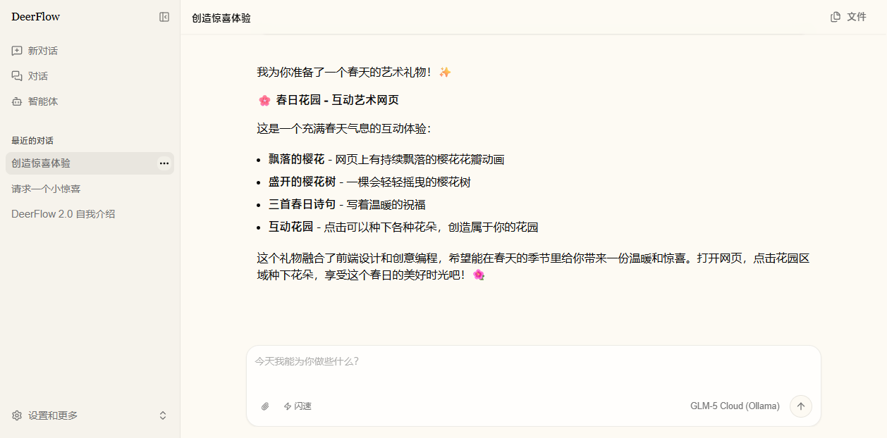

- 查看智能体的系统提示词和配置
- 与该智能体开始对话
- 管理智能体（重命名、删除）

#### 2.3.3 创建新智能体

1. 点击 **"新建智能体"** 按钮
2. 在对话框中描述你想要的智能体
3. DeerFlow 会引导你设置名称和系统提示词
4. 创建完成后即可开始使用

智能体名称规则：只允许字母、数字和连字符，自动转为小写。

---

### 2.4 Artifact（生成物）系统

当 AI 在对话中生成了文件（代码、网页、图片等），右上角会显示 **"文件"** 按钮：

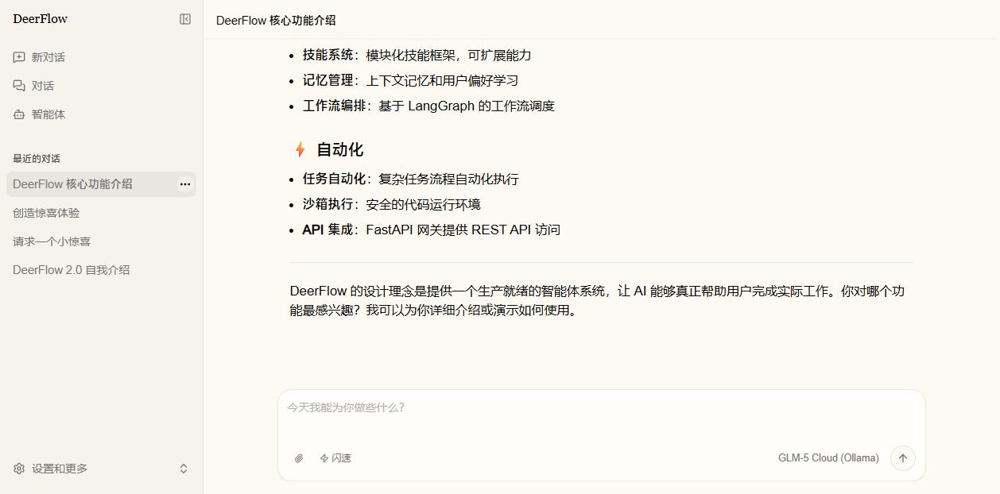

#### 2.4.1 支持的文件类型

| 文件类型 | 渲染方式 |
|----------|----------|
| **HTML** | 代码/预览 双模式（预览用 iframe sandbox） |
| **Markdown** | 代码/预览 双模式（Streamdown 渲染器） |
| **代码文件** | 只读代码编辑器（支持 100+ 种语言） |
| **图片** | 原始展示 |
| **音视频** | 原始展示 |
| **Skill 文件** | 以 Markdown 预览（读取 SKILL.md） |

#### 2.4.2 Artifact 面板操作

- **文件选择器**：顶部下拉菜单切换不同文件
- **代码/预览切换**：HTML 和 Markdown 文件支持双模式
- **操作按钮**：
  - 安装（仅 .skill 文件）
  - 在新窗口打开
  - 复制到剪贴板
  - 下载文件
  - 关闭面板

面板采用可拖拽的分屏布局，默认聊天区 60%、Artifact 区 40%，可自由调整比例。

---

### 2.5 对话管理

#### 2.5.1 对话列表

侧边栏显示最近的对话历史，每个对话支持：

| 操作 | 说明 |
|------|------|
| **重命名** | 修改对话标题 |
| **分享** | 复制对话链接 |
| **删除** | 删除对话（不可撤销） |

#### 2.5.2 对话搜索

进入 `/workspace/chats` 页面，可搜索所有历史对话（按标题模糊匹配）。

---

### 2.6 典型使用场景

#### 场景一：深度研究并生成报告

1. 在输入框中输入：`深入浅出的研究一下2026年AI Agent的发展趋势，并总结发现。`
2. 选择 **Pro** 或 **Ultra** 模式以获得更深入的分析
3. DeerFlow 会自动搜索网络、分析信息、生成结构化报告
4. 生成的报告会作为 Artifact 在右侧面板展示

#### 场景二：生成 PPT 幻灯片

1. 点击 **"创建"** → **选择其他技能**（如果有 ppt-generation 技能）
2. 或直接输入：`生成一个关于人工智能发展历程的PPT`
3. AI 会规划幻灯片内容，为每张生成配图，输出 PPTX 文件
4. 在 Artifact 面板中下载生成的 PPT

#### 场景三：创建网页

1. 点击 **"创建"** → **"网页"**
2. 将 `[主题]` 替换为你的主题，例如：`生成一个关于咖啡文化的网页`
3. AI 会生成完整的 HTML/CSS/JS 网页代码
4. 在 Artifact 面板中可以实时预览网页效果

#### 场景四：数据分析

1. 上传你的数据文件（CSV、Excel 等）
2. 输入分析需求，例如：`分析这个销售数据，找出趋势和关键指标`
3. AI 会读取文件、分析数据、生成图表和报告

#### 场景五：创建自定义技能

1. 点击 **"创建"** → **"技能"**，或进入设置 → 技能 → 新建技能
2. DeerFlow 会引导你描述技能需求
3. 自动生成 SKILL.md 文件
4. 安装后即可在对话中使用

#### 场景六：GitHub 项目分析

1. 输入：`分析 https://github.com/bytedance/deer-flow 这个项目`
2. AI 会自动使用 github-deep-research 技能
3. 多轮深度分析仓库结构、代码质量、提交历史
4. 输出结构化的 Markdown 分析报告

---

### 2.7 快捷键与效率技巧

| 技巧 | 说明 |
|------|------|
| **Enter 发送** | 在输入框中按 Enter 发送消息 |
| **Shift+Enter 换行** | 在输入框中输入多行内容 |
| **点击建议直接发送** | 点击后续建议自动填入并发送 |
| **拖拽上传** | 将文件拖到页面任意位置上传 |
| **侧边栏折叠** | 点击切换按钮节省屏幕空间 |
| **Artifact 分屏** | 拖拽分割线调整对话和文件面板比例 |

---

### 2.8 注意事项

1. **模型兼容性**：不同模型支持的功能不同，不支持思考模式的模型会自动降级为闪速模式
2. **Windows 部署**：本版本为 Windows 原生适配版，无需 Docker/nginx/WSL
3. **端口占用**：确保 3000、8001、2024 端口未被占用
4. **环境变量修改**：修改 `.env` 文件后需要重启服务才能生效
5. **记忆功能**：DeerFlow 会自动学习你的偏好，如需清除可在设置中管理
6. **对话不可恢复**：删除对话后无法恢复，请谨慎操作
